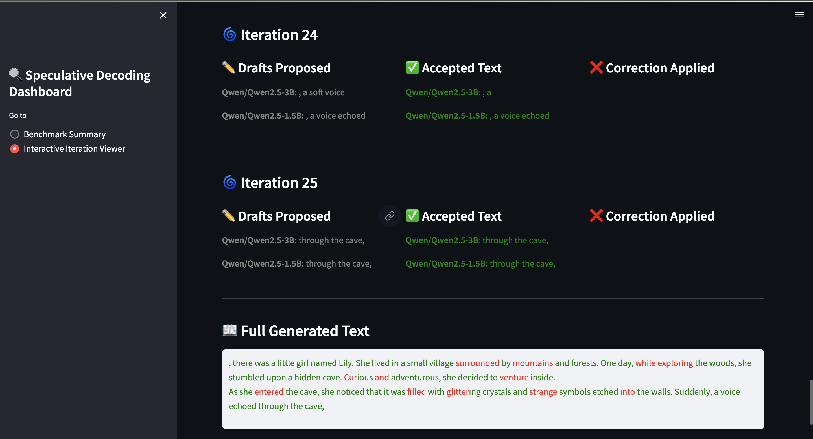

# ⏱️ Speculative Decoding
This repository offers a complete, reference implementation of **speculative decoding** algorithms for **large language models**. It implements two interchangeable strategies—(1) a **tree-based** approach that merges multi-beam drafts from lightweight speculative models into a single trie and verifies every branch in one forward pass, and (2) a **sequential** draft-verification loop that accepts tokens step-by-step. Alongside the core **Python** code, the repo includes **benchmarking scripts**, extensive **JSON logging**, and a **Streamlit dashboard** so you can explore approach **trade-offs** and understand exactly how speculative decoding works while **LLM inference**.

> **Purpose & Limitations**  
> This repository provides speculative‑decoding algorithms with a <ins>pure‑Python reference implementation</ins> and visualization tools. It is intended for learning and experimentation—**not** for production‑grade speed‑ups you would get from a low‑level (C++/CUDA) backend.


## ✍️ Introduction

Large Language Models (LLMs) are remarkably capable, yet their autoregressive nature makes inference costly. **Speculative decoding** cuts latency by letting lightweight **speculative models (SSMs)** propose future tokens that a heavyweight **target model** verifies.  
This repo offers two interchangeable strategies:

- **Tree‑based attention** – multi‑beam drafts are merged into a Trie and verified in _one_ forward pass.
- **Sequential draft‑verification** – classic token‑by‑token acceptance loop for baselines and ablations.

Everything is implemented with PyTorch + Transformers—no custom kernels required.

---

## 🗺️ Table of Contents

1. [Directory Structure](#1-directory-structure)
2. [How to Run](#2-how-to-run)
3. [Benchmarking](#3-benchmarking)
4. [Highlights](#4-highlights)
5. [Methodology](#5-methodology)
6. [Example Prompt](#6-example-prompt)
7. [Future Optimizations](#7-future-optimizations)

---

## 1. 🗂️ Directory Structure

```text
project_root/
├── config.py                # Configurable prompts, models, decoding mode, beam params
├── main.py                  # CLI entry for single‑prompt runs
├── run_benchmark.py         # Batch benchmark runner
├── controller.py            # Sequential speculative controller
├── controller_tree.py       # Tree‑based speculative controller
├── sequential_utils.py      # Drafter & verifier helpers
├── tree_utils.py            # Trie + tree‑mask utilities
├── model_loader.py          # CUDA‑aware model loader
├── benchmarking/
│   ├── analyze.py           # Aggregate log metrics
│   ├── visualize.py         # Streamlit dashboard
│   ├── benchmark_summary.csv
│   └── config.py            # Benchmark parameters
├── logs/                    # JSON logs per run
└── README.md                # You are here
```

---

## 2. How to Run

### Single Prompt via CLI

```bash
python main.py \
  --prompt "The future of AI is" \
  --mode tree            # or sequential
  --draft_length 9 \
  --max_tokens 40 \
  --verbose
```

`--mode` options:

- `sequential` – draft + verify in rounds
- `tree` – multi‑beam drafts, one target pass with tree mask

---

## 3. Benchmarking

Run a full sweep across prompts and configs:

```bash
python benchmarking/run_benchmark.py
```

Key grid in `benchmarking/config.py`:

```python
CONFIG = {
    "target_model": "Qwen/Qwen2.5-3B",
    "draft_models": ["Qwen/Qwen2.5-0.5B", "Qwen/Qwen2.5-1.5B"],
    "max_new_tokens_list": [40, 80, 120],
    "sequential_draft_lengths": [2, 4, 6, 8, 10],
    "tree_beam_widths": [1, 2, 3, 5, 6],
    "tree_beam_depths": [2, 4, 6, 8, 10],
    "prompts": [
        "Once upon a time",
        "The future of AI is",
        "The president of the USA is",
        "In a galaxy far away",
    ],
}
```

### 📊 Interactive Dashboard

```bash
streamlit run benchmarking/visualize.py
```

Features:

- Iteration by Iteration visualization of generated, accepted, and correction tokens
- Interactive table filtering (Prompt, Strategy, Configs)
- Scatter and stacked bar plots for performance analysis
- Aggregated statistics across strategies
- Best performing tree, sequential configurations
- Comparison across different target-draft model setups

### Visualizations

<span style="color:red">Red tokens</span> are correction tokens added by the target, while <span style="color:green">green tokens</span> are the accepted tokens generated by the draft model.



<br>

Scatter and stacked bar plots for performance analysis, and aggregated statistics across different strategies.


---

## 4. ✨ Highlights

- **Swap controllers** instantly with a flag.
- **Trie‑merged token tree** + custom attention ⇒ single verification pass.
- **Parallel multi‑draft generation** for extra speed.
- **Rich JSON logs** capturing token‑level decisions.
- **Streamlit dashboard** for exploratory analysis.

---

## 5. Methodology

### 5.1 System Architecture

<p align="center"></p>

### 5.2 Tree‑Based Speculative Decoding

1. **Prompt Encoding** – tokenize prompt → `current_ids`
2. **Speculative Beam Generation** – each SSM runs beam search (`beam_width × beam_depth`).
3. **Beam Merging** – deduplicate & merge beams into a Trie.
4. **Custom Attention Mask** – each node attends to prompt + ancestors; verify all nodes in **one** target pass.
5. **Verification** – accept matching paths; on mismatch append bonus token.
6. **Fallback** – greedy target step if first token fails or tree empty.
7. **Iterate** until EOS or `max_tokens`.

### 5.3 Sequential Speculative Decoding

1. **Prompt Init** – tokenize prompt.
2. **Parallel Drafts** – each SSM generates a fixed‑length greedy continuation.
3. **Token‑Level Verification** – compare each draft token to target logits.
4. **Select Best Draft** – longest verified prefix wins.
5. **Correction** – if none fully match, append target token.
6. **Iterate** until EOS or `max_tokens`.

### 5.4 Strategy Comparison

| Aspect           | Tree‑Based                      | Sequential                          |
| ---------------- | ------------------------------- | ----------------------------------- |
| Draft generation | Multi‑beam per SSM → token tree | Greedy sequence per draft (threads) |
| Verification     | **One** batched target pass     | Token‑by‑token passes               |
| Acceptance       | Accept contiguous branch        | Accept prefix until mismatch        |
| Fallback         | Target bonus token              | Greedy target token                 |
| Search space     | Parallel branches               | Single branch/step                  |
| Next draft       | Highest‑matching path           | Draft with longest prefix           |


### 5.5 Metrics & Logging

Every run (tree or sequential) logs a single JSON with all or subset of the following:

| Metric Key | Description |
|------------|-------------|
| `tokens_generated` | Final length of the generated continuation |
| `draft_tokens_proposed` | Speculative tokens produced by all SSMs |
| `draft_tokens_accepted` | Tokens verified & accepted without modification |
| `corrections_by_target` | Tokens *added* by the target model when drafts mismatch |
| `percent_tokens_saved` | `(draft_tokens_accepted / tokens_generated) × 100` – rough efficiency measure |
| `verification_calls` | How many forward passes on the target model were made |
| `max_new_tokens` | Upper cap on tokens the run was allowed to generate |
| `draft_length` | Per‑draft speculative length (sequential) *or* `beam_depth` (tree) |
| `beam_width` | Number of beams per SSM (tree mode only) |
| `beam_depth` | Depth of each beam sequence (tree mode only) |
| `tree_nodes_total` | Total nodes in the merged token trie (tree mode) |
| `tree_accepted_tokens` | Tokens validated via tree verification (tree mode) |

Logs are saved to the `logs/` directory and power the Streamlit dashboard.

---

## 6. Example Prompt

```python
prompt = "The future of AI is"
```

Sample continuation:

```
…The future of AI is in the hands of the people who build it. The people who build it are the people who will use it. The people who will use it are the people who will be affected by it…
```

---

## 7. 💡 Future Optimizations

- Reuse **KV‑cache** instead of re‑encoding prompt.
- Dynamic tree depth based on live acceptance rate.
- Quantized / distilled drafts integration.

---

> **License** Apache‑2.0 · **Author** Anubhav Sharma · <sub>Updated Apr 2025</sub>
