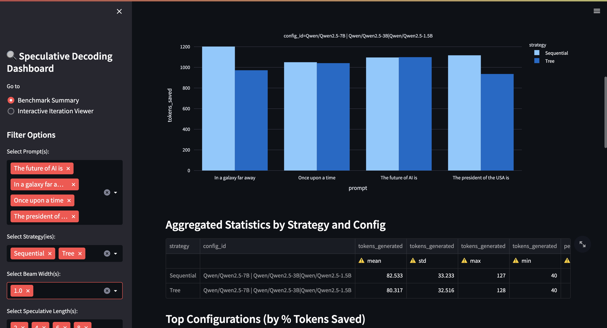

# Speculative Decoding

This repo provides an end-to-end implementation of speculative decoding using both a **tree-based attention strategy** and a **sequential draft-verification strategy**. The goal is to accelerate large language model (LLM) inference by generating speculative candidates using draft models and verifying them efficiently with the target model.

---

## Directory Structure

```
project_root/
├── config.py                # Configurable prompts, models, decoding mode, beam params
├── main.py                  # CLI entry point for single prompt runs
├── run_benchmark.py         # Batch benchmark runner (multiple prompts, speculative lengths)
├── controller.py            # Sequential speculative decoding controller
├── controller_tree.py       # Tree-based speculative decoding controller
├── sequential_utils.py      # Drafter and verifier utilities for sequential mode
├── tree_utils.py            # Trie structure, tree mask, verifier logic for tree mode
├── model_loader.py          # Model loading on available CUDA devices
├── benchmarking/
│   ├── analyze.py           # Analyze logs and summarize results
│   ├── visualize.py         # Streamlit interactive dashboard for results
│   ├── benchmark_summary.csv# Aggregated results
│   └── config.py            # Benchmarking configuration
├── logs/                    # JSON logs with detailed metrics per run
└── README.md                # You're here
```

---

## How to Run

### 1. Single Prompt via CLI

```bash
python main.py \
  --prompt "The future of AI is" \
  --mode tree \
  --draft_length 9 \
  --max_tokens 40 \
  --verbose
```

Supported `--mode`:
- `sequential`: Draft + verify in rounds
- `tree`: Multi-beam speculative decoding + single target pass with tree attention

---

### 2. Benchmarking 
Run full benchmark sweep across prompts, speculative settings, and models in the config file.

```bash
python benchmarking/run_benchmark.py
```

Uses configuration from `benchmarking/config.py`:
```python
CONFIG = {
    "target_model": "Qwen/Qwen2.5-3B",
    "draft_models": ["Qwen/Qwen2.5-0.5B", "Qwen/Qwen2.5-1.5B"],
    "max_new_tokens_list": [40, 80, 120],
    "sequential_draft_lengths": [2, 4, 6, 8, 10],
    "tree_beam_widths": [1, 2, 3, 5, 6],
    "tree_beam_depths": [2, 4, 6, 8, 10],
    "prompts": [
        "Once upon a time",
        "The future of AI is",
        "The president of the USA is",
        "In a galaxy far away"
    ]
}
```

---

### 3. Interactive Analysis

```bash
streamlit run benchmarking/visualize.py
```

Features:
- Iteration by Iteration visualization of generated, accepted, and correction tokens
- Interactive table filtering (Prompt, Strategy, Configs)
- Scatter and stacked bar plots for performance analysis
- Aggregated statistics across strategies
- Best performing tree, sequential configurations
- Comparison across different target-draft model setups

### 1. Generation Visualization
<span style="color:red">Red tokens</span> are correction tokens added by the target, while <span style="color:green">green tokens</span> are the accepted tokens generated by the draft model.


### 2. Statistics About Token Generation
Scatter and stacked bar plots for performance analysis, and aggregated statistics across different strategies.


---

## Highlights

- Modular design: easily swap between tree-based and sequential controllers.
- Tree-based speculative decoding with efficient token tree merging and custom attention masks.
- Sequential speculative decoding with token-by-token draft verification.
- Multi-draft generation using threading for speed.
- Fully benchmarked and logged experiments saved under `logs/`.
- Interactive dashboard for analysis and plots.

---

## METHODOLOGY

---

### Comparison 

| Aspect                | Tree-Based                                                             | Sequential                                                    |
|------------------------|------------------------------------------------------------------------|---------------------------------------------------------------|
| Draft generation       | Multiple beams per SSM → merged into a token tree                      | Parallel threaded Single greedy sequence per draft model                      |
| Verification style     | One batched target pass over the full tree with attention mask          | Token-by-token sequential verification using logits          |
| Acceptance             | Accepts full paths where target predictions match the tree             | Accepts linear prefix until target and draft disagree        |
| Fallback               | At first mismatch, bonus token from target is added                    | At mismatch, greedy target token is appended                 |
| Search space           | Explores multiple speculative branches at once                         | Only one branch per draft per step                           |
| Next draft selection   | Highest matching path across all branches                              | Draft with longest accepted prefix                           |

---

### Tree-Based Speculative Decoding for Efficient LLM Inference

This project implements a **Tree-Based Speculative Decoding** pipeline that speeds up text generation from large language models (LLMs) by leveraging multiple lightweight speculative models (SSMs) and verifying their predictions in a single pass using a powerful target model.

---

### High-Level Overview of the Pipeline

```
         ┌────────────┐
         │   Prompt   │
         └────┬───────┘
              ↓
     ┌──────────────────────┐
     │ SSM Beam Generation  │  ← multiple small models
     └────────┬─────────────┘
              ↓
     ┌──────────────────────┐
     │ Merge into Token Tree│ ← deduplicates beams into Trie
     └────────┬─────────────┘
              ↓
     ┌────────────────────────┐
     │ Target Model (1 pass)  │ ← verifies multiple tokens at once
     └────────┬───────────────┘
              ↓
     ┌──────────────────────┐
     │ Accept & Extend Seq  │ ← follows path as long as target agrees
     └──────┬───────────────┘
            ↓
Fallback if no match:
   ┌─────────────────────────────┐
   │ Greedy step from target LLM │
   └─────────────────────────────┘
```

---

### Step-by-Step Breakdown

### 1. **Prompt Encoding**

- The user prompt is tokenized with the target model's tokenizer.
- Stored as `current_ids`, which gets extended as generation proceeds.

### 2. **Speculative Beam Generation**

- Each SSM (e.g., `Qwen2.5-3B`, `Qwen2.5-1.5B`) performs beam search on the current prefix.
- Beams are collected with configurable `beam_width` and `beam_depth`.

### 3. **Beam Merging into a Token Tree**

- Beams from all SSMs are deduplicated and merged into a **Trie (token tree)**.
- This tree allows branching speculative paths and efficient batch verification.

### 4. **Custom Attention Mask Construction**

- A mask is built that allows each speculative token to attend to:
  - All original prompt tokens
  - Its ancestors in the tree
- This allows the target model to understand the context of each speculative token accurately without inter-branch leakage.
- Used to verify all tree paths in a **single forward pass** through the target model using the custom attention mask.
- This outputs logits for each token in the tree, allowing parallel next-token prediction for every node.

### 5. **Tree-Based Verification**

- The target model’s predictions are compared against each node in the tree:
  - Tokens are **accepted** as long as target predictions match the tree structure.
  - When a mismatch is encountered, the predicted token is **appended as a bonus** and verification stops.

### 6. **Fallback Mode**

- If the tree is empty or the first token fails verification, the system performs **greedy decoding** using the target model.
- Ensures generation continuity even when speculative guesses fail.

### 7. **Iteration**

- Steps 2–6 are repeated until:
  - A configured number of tokens is generated, or
  - An end-of-sequence (EOS) token is generated

---

### 📊 Metrics and Logging (per run)

Saved under `logs/` as JSON files.

Includes:
- `tokens_generated`
- `tree_accepted_tokens`
- `tree_bonus_tokens`
- `tree_nodes_total`
- `tree_avg_branching_factor`
- `tree_verification_calls`
- Per-iteration accepted sequences
- 
---

### Sequential Speculative Decoding (Multi-Draft, Verifier-Based)

This project implements a **Sequential Speculative Decoding** approach for efficient LLM inference. Instead of tree-based decoding, this version performs **step-by-step verification** of speculative drafts from multiple small models using a verifier function that simulates the behavior of a target LLM.

---

### High-Level Overview of the Pipeline

```
         ┌────────────┐
         │   Prompt   │
         └────┬───────┘
              ↓
     ┌────────────────────────┐
     │ Generate Drafts (SSMs) │ ← Multiple draft models in parallel
     └────────┬───────────────┘
              ↓
     ┌────────────────────────────┐
     │ Verify with Target Logits │ ← Check predictions token-by-token
     └────────┬──────────────────┘
              ↓
     ┌────────────────────────┐
     │ Accept Matching Tokens │ ← As long as draft matches target
     └────────┬───────────────┘
              ↓
If mismatch:
   ┌────────────────────────────┐
   │ Add correction by target   │ ← Single token greedy generation
   └────────────────────────────┘
```

---

### Step-by-Step Breakdown

### 1. **Prompt Initialization**
- Tokenize the prompt using the target model’s tokenizer.
- Initialize a copy as the working sequence (`current_ids`).

### 2. **Speculative Drafting (Multi-threaded)**
- All draft models run beamless (`do_sample=False`) greedy generation in parallel.
- Each draft model generates a fixed-length speculative continuation.

### 3. **Token-by-Token Verification**
- For each draft, use the target model logits to verify tokens:
  - Compare each draft token to the target model’s prediction.
  - Stop at first mismatch and optionally generate the correct token.

### 4. **Best Draft Selection**
- From all drafts, pick the one with the **most tokens verified successfully**.
- Log all proposals, acceptances, and corrections for detailed analysis.

### 5. **Correction Step**
- If no draft is fully accepted, call the target model once to generate the next correct token.

### 6. **Iteration Until Completion**
- Continue the draft + verify loop until either:
  - The EOS token is generated
  - The max number of new tokens is reached

---

### 📊 Metrics and Logging (per run)

Each run logs:
- Total tokens generated
- Number of draft tokens proposed / accepted
- Corrections inserted by the target
- Per-draft acceptance rates
- Effective savings compared to greedy decoding

Output is stored as a structured JSON log:
```bash
logs/specdraft_verbose_YYYYMMDD_HHMMSS.json
```

---

### Example Prompt

```python
prompt = "The future of AI is"
```

Sample generated continuation:
```
...The future of AI is in the hands of the people who build it. The people who build it are the people who will use it. The people who will use it are the people who will be affected by it. The people who will be affected
```

---

## Future Optimizations?

- Add KV-Cache Reuse instead of appending to the current accepted text.
- Add dynamic adjustments to the tree lengths.
- Combine with quantized or distilled draft models
- Adapt to `vLLM`, `FlexServe`, or `TGI` for production inference

---


